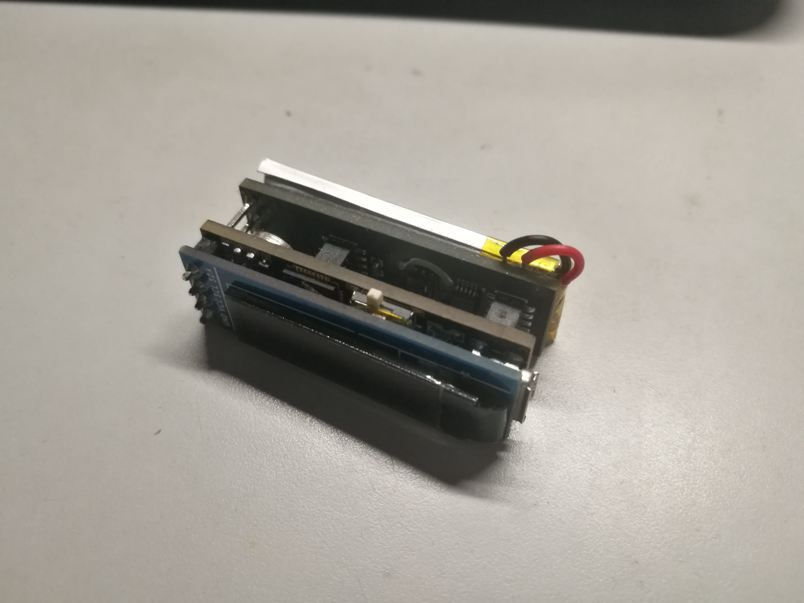
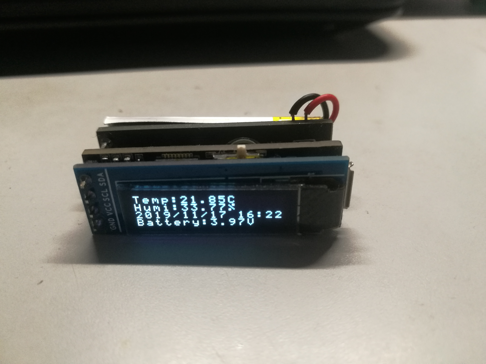
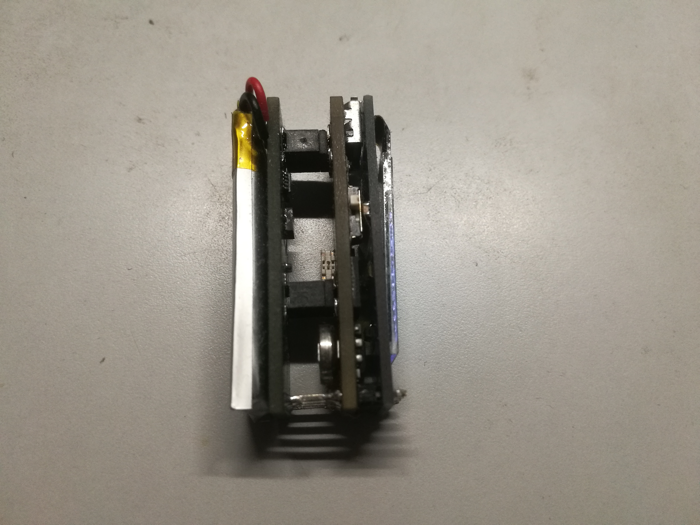

# A thermometer with a serial port calibrated clock.

SHT20 and DS3231M on board, can display current time, temperature, humidity and battery voltage.
It is designed to use a serial port to update the time from the computer, but it is not implemented in the program.

There is a problem with the power path in the current pcb design, and it cannot run normally when powered by 5v.

It has been proved that the problem is due to the lack of batteries.

The following website is Chinese content
以下网站是中文内容
https://irongu.cn/2019/09/13/oc711/
